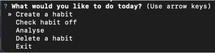
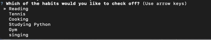
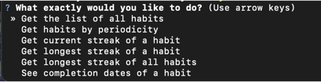
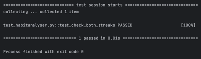
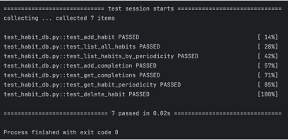

Habit Tracker Application - Object-Oriented and Functional Programming Portfolio Project
---
Habit Tracker App is an application created to help users stick to their habits. It has a form 
of a simple command-line interface (CLI). It stores data via SQLite connection, which allows
users to retrieve the data from the database for habit analysis.
---

## Key features

- the application tracks both daily and weekly habit periodicities.
- data is stored in a SQLite database.
- calculation of current streak of a habit (most recent) and the longest (historic).
- seamless user experience powered by questionary library. 

---

## How it works? An application preview. 
In the first step, a user can choose an action for today from the menu.



If a user chooses 'check habit off', then, another menu pup up with the list of available habits. 



In the analytic module, a user can choose the following actions:



## Requirements & Installation

### Prerequisites
- Python: Version 3.7 or higher.
- Pip: Python package installer.

### Step 1: Clone the Repository
```bash
git clone [https://github.com/yourusername/habit-tracker-app.git](https://github.com/yourusername/habit-tracker-app.git)
cd habit-tracker-app
```
### Step 2: Create a virtual environment

### On Linux or Mac:
```bash
python3 -m venv venv
source venv/bin/activate
```
### On Windows:
```bash
python -m venv venv
venv\Scripts\activate
```
### Step 3: Install the dependencies
```bash
pip install -r requirements.txt
```
### Step 4: Run the app 
Run the code in the terminal. 
```bash
python main.py
```
### (Optional) Step 5: Habit demo data
To check the analytic module. It is filled with 5 habits that have 4 weeks of completion dates.
```bash
python habit_data.py
```
## Testing 
The application uses pytest to check the functionality of Habit, HabitAnalyser, and HabitDB classes.
To test the application, execute:
```bash
pytest test/
```
The application has been tested before uploading it here. 
The analytics module as well as the database functionality have been tested. 




## Architecture of the project
- main.py: CLI controller.
- habit.py: Habit object class.
- habit_analyser.py: HabitAnalyser, used for calculating streaks.
- habit_database.py: HabitDB class, used for database-related functionality.
## Limitations and Future Development
- Current limitation: the app only works as CLI application.
- Future development: implementation of Graphical User Interface, Data Visualisation, sending notifications. 
 
